# Social Network API

A robust and scalable API designed for modern social networking platforms, built with Node.js, Express, and MongoDB.

## 🌟 Features

- **User Management**: Create, read, update, and delete user profiles.
- **Thoughts**: Users can share their thoughts, update them, and even delete them.
- **Friendship Management**: Users can add and remove friends, enhancing interactivity.
- **Reactions**: Users can react to thoughts, simulating a real-world social interaction.
- **Performance Optimizations**: Efficient database operations with MongoDB indexing and caching.
- **Security**: Implemented basic security features to ensure data integrity and protection.

## 📸 Screenshot

### Get all users

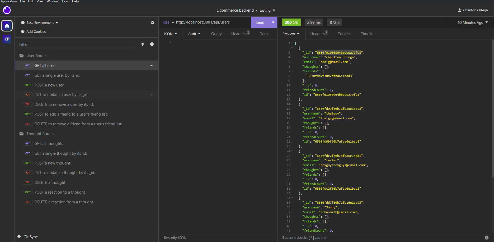

### Get a single user

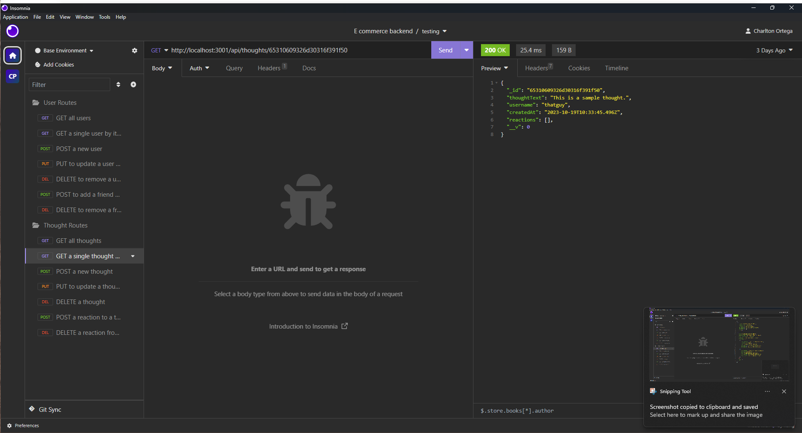

### Create a new user

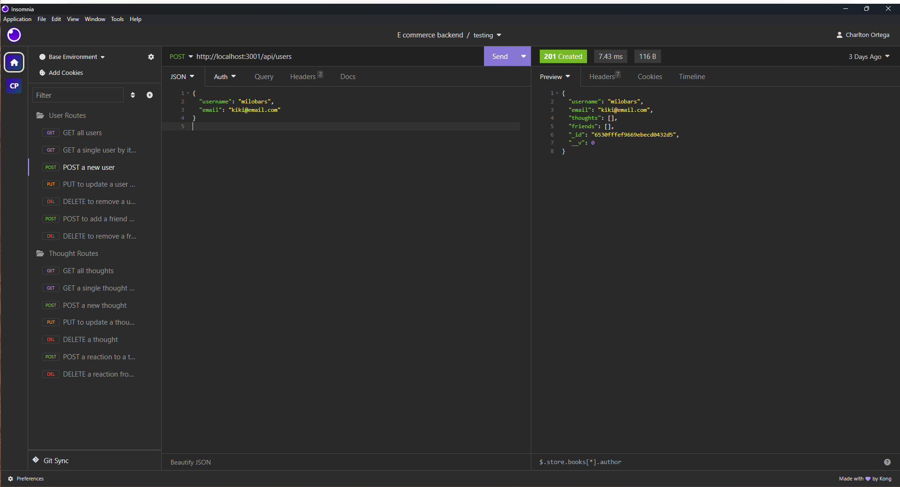

### Update a user

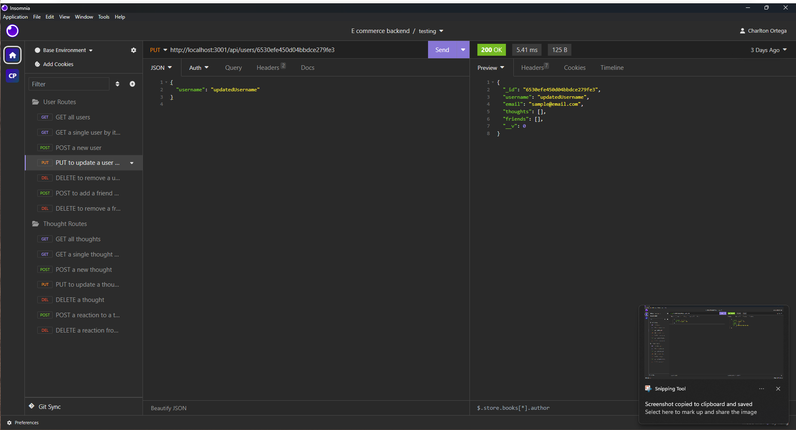

### Delete a user

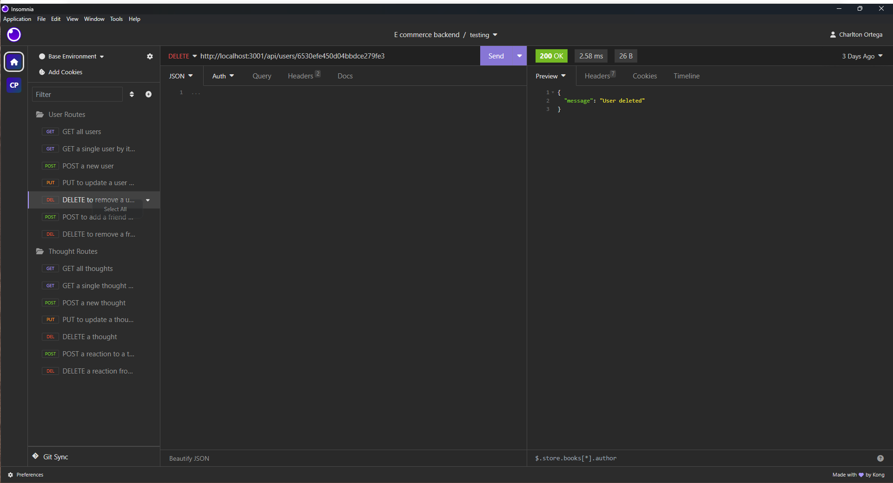

### Add a friend


### Remove a friend

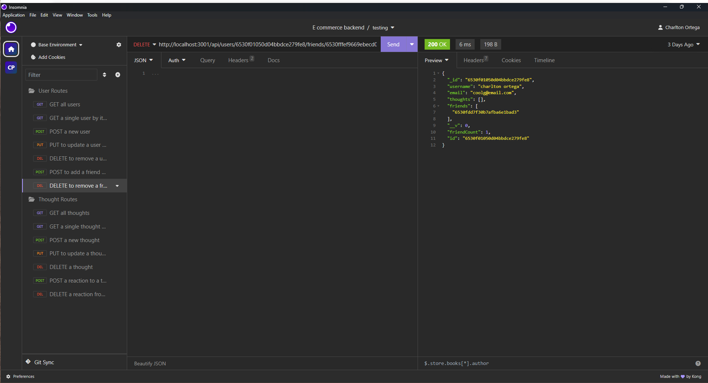
### Get all thoughts

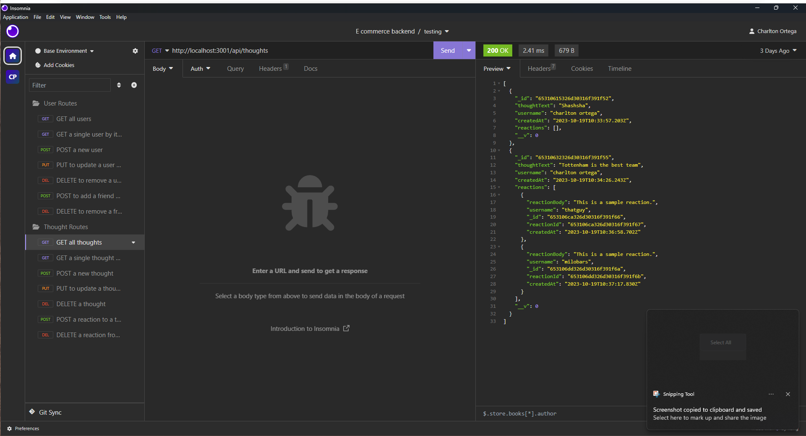

### Get a single thought

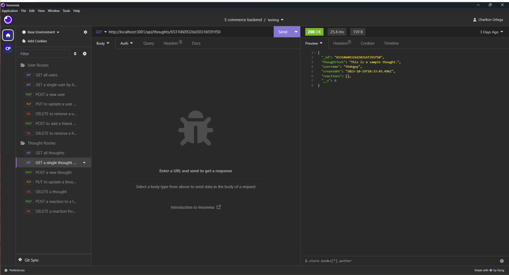

### Create a new thought

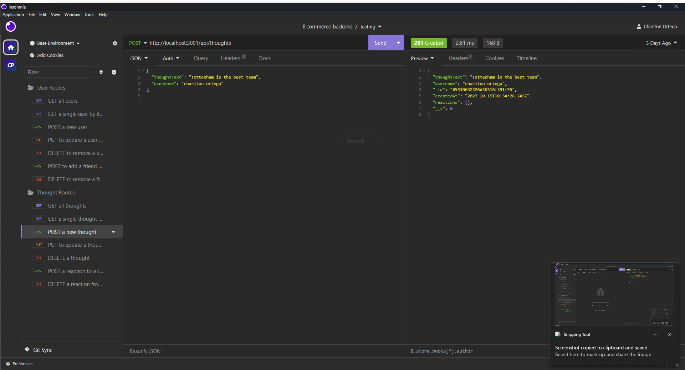

### Update a thought

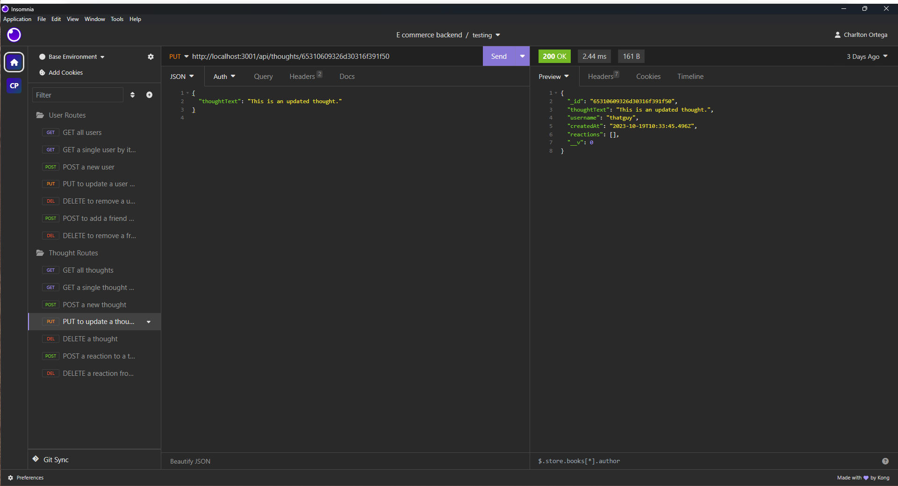

### Delete a thought

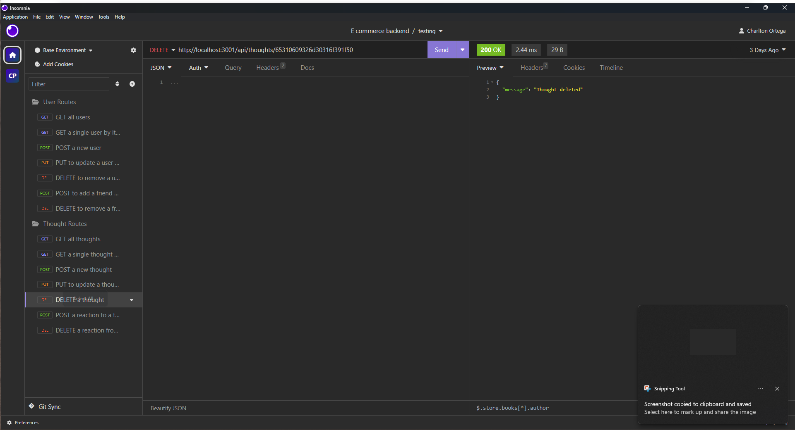

### Add a reaction

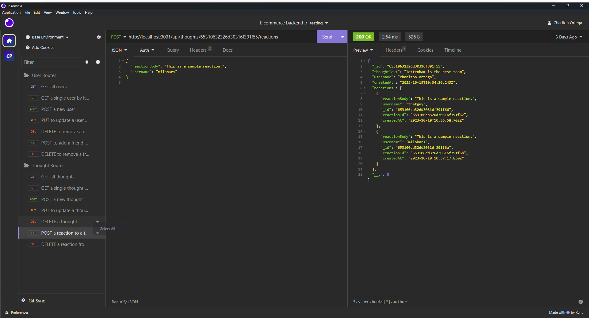

### Delete a reaction

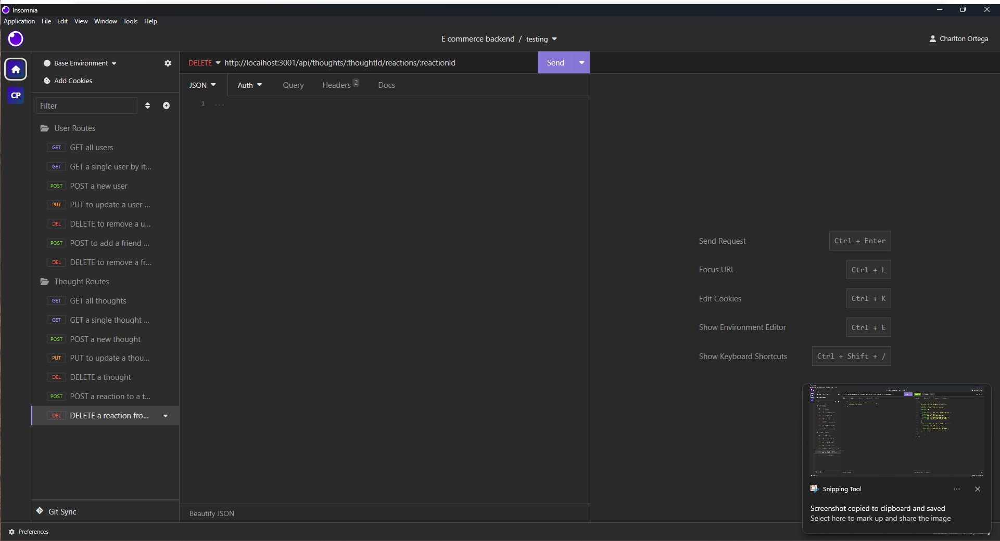


## 📷 Video Demo

### Click here to watch demo

[Watch the Video Demo](https://drive.google.com/file/d/133YaKL4T4gYAddGjYYTtIRN3QJ7R3-Eh/view?usp=sharing)

## 🛠 Setup

1. **Clone the Repository**:
   ```bash
   git clone https://github.com/charltonortega/social-network-api.git
   cd social-network-api
   ``````

2. **Install Dependencies**:
   ```bash
   npm install
   ```
3. **Environmental Variables**:
   ```bash
    MONGODB_URI=your_mongodb_connection_string
    PORT=your_port_number
   ```
4. **Run the Server**:
   ```bash
   node server.js
   ```
## 🔗 Links

## 💻 Usage

### **Users**

1. **Create a New User**:
   - **Endpoint**: `POST /api/users`
   - **Body**:
     ```json
     {
       "username": "sampleUser",
       "email": "sample@email.com"
     }
     ```

2. **Retrieve All Users**:
   - **Endpoint**: `GET /api/users`

3. **Retrieve a Single User by ID**:
   - **Endpoint**: `GET /api/users/:id`

4. **Update a User by ID**:
   - **Endpoint**: `PUT /api/users/:id`
   - **Body** (example):
     ```json
     {
       "username": "updatedUsername"
     }
     ```

5. **Delete a User by ID**:
   - **Endpoint**: `DELETE /api/users/:id`

6. **Add a Friend to a User's Friend List**:
   - **Endpoint**: `POST /api/users/:userId/friends/:friendId`

7. **Remove a Friend from a User's Friend List**:
   - **Endpoint**: `DELETE /api/users/:userId/friends/:friendId`

### **Thoughts**

1. **Create a New Thought**:
   - **Endpoint**: `POST /api/thoughts`
   - **Body**:
     ```json
     {
       "thoughtText": "This is a sample thought.",
       "username": "sampleUser"
     }
     ```

2. **Retrieve All Thoughts**:
   - **Endpoint**: `GET /api/thoughts`

3. **Retrieve a Single Thought by ID**:
   - **Endpoint**: `GET /api/thoughts/:id`

4. **Update a Thought by ID**:
   - **Endpoint**: `PUT /api/thoughts/:id`
   - **Body** (example):
     ```json
     {
       "thoughtText": "This is an updated thought."
     }
     ```

5. **Delete a Thought by ID**:
   - **Endpoint**: `DELETE /api/thoughts/:id`

### **Reactions**

1. **Add a Reaction to a Thought**:
   - **Endpoint**: `POST /api/thoughts/:thoughtId/reactions`
   - **Body**:
     ```json
     {
       "reactionBody": "This is a sample reaction.",
       "username": "anotherUser"
     }
     ```

2. **Remove a Reaction from a Thought**:
   - **Endpoint**: `DELETE /api/thoughts/:thoughtId/reactions/:reactionId`

## 📚 Resources

- [Mongoose Documentation](https://mongoosejs.com/docs/)
- [MongoDB Documentation](https://www.mongodb.com/docs/manual/)

## 🤝 Contributing
Pull request are welcome, For major changes please open issue first to dicuss what you would like to change.

## 📝 License
This project is licensed under the MIT License - see the [LICENSE](LICENSE) file for details.
